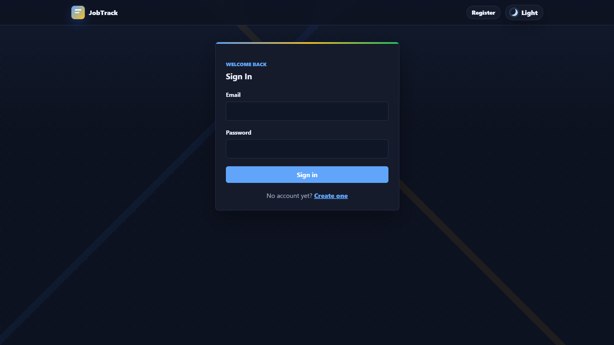
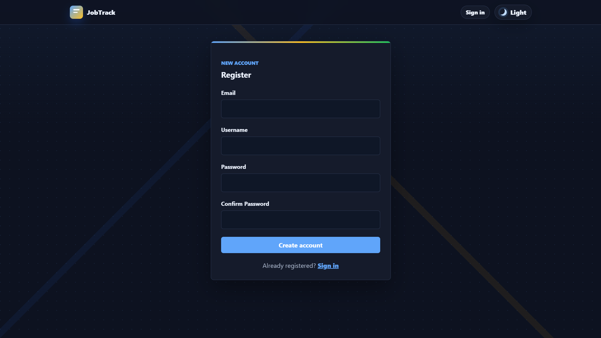
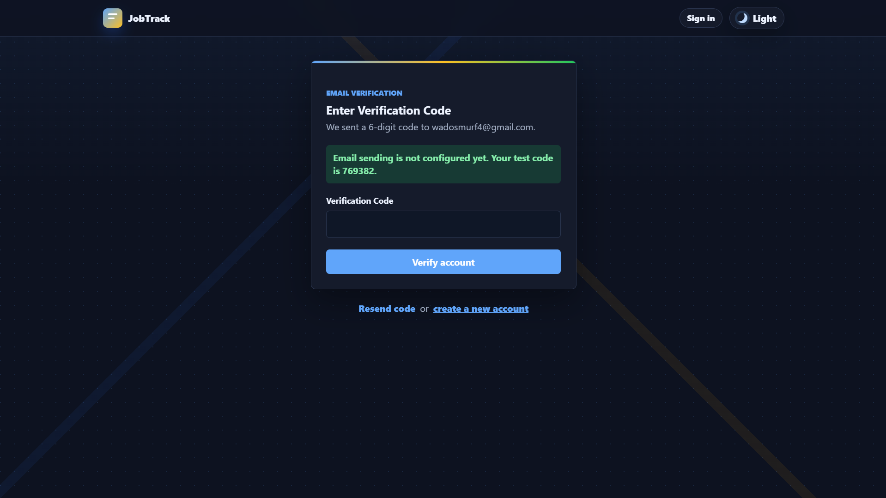
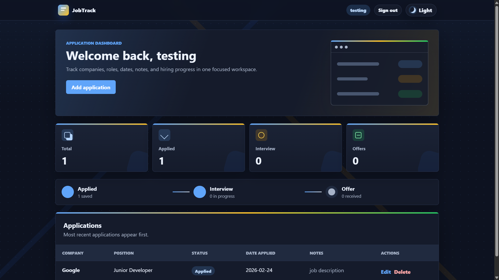
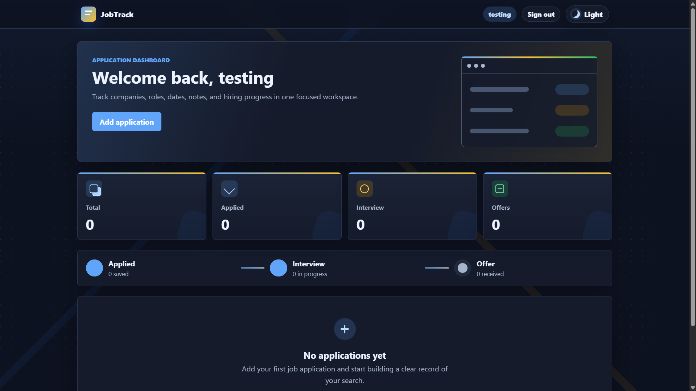
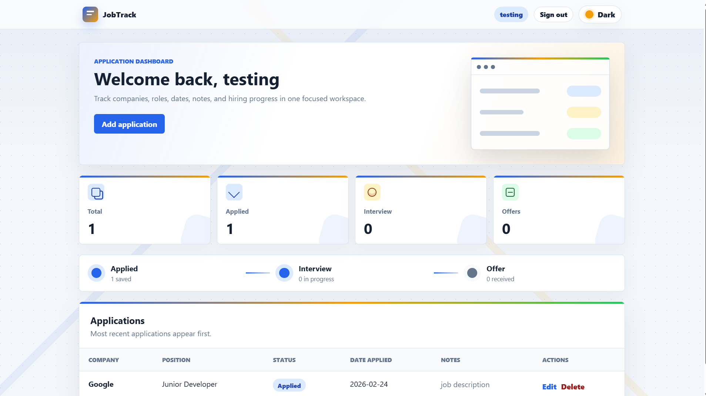
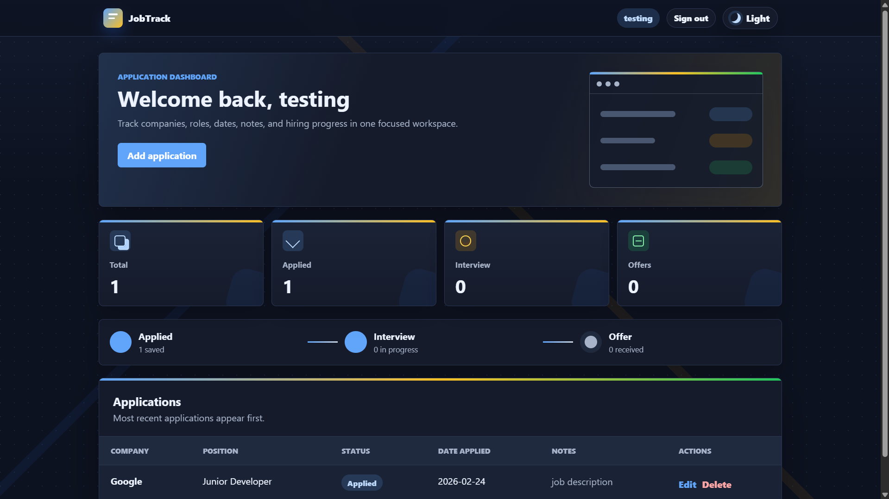
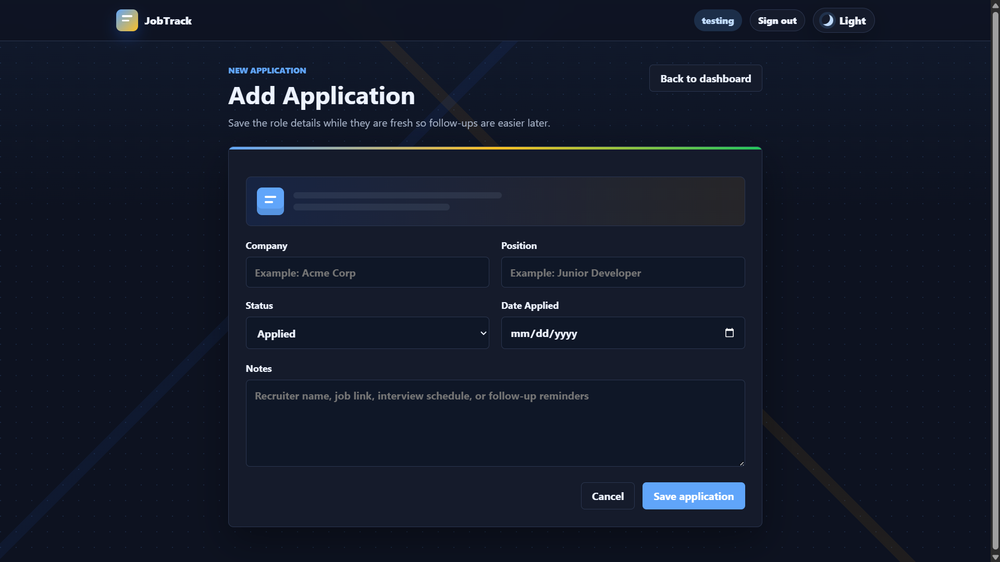
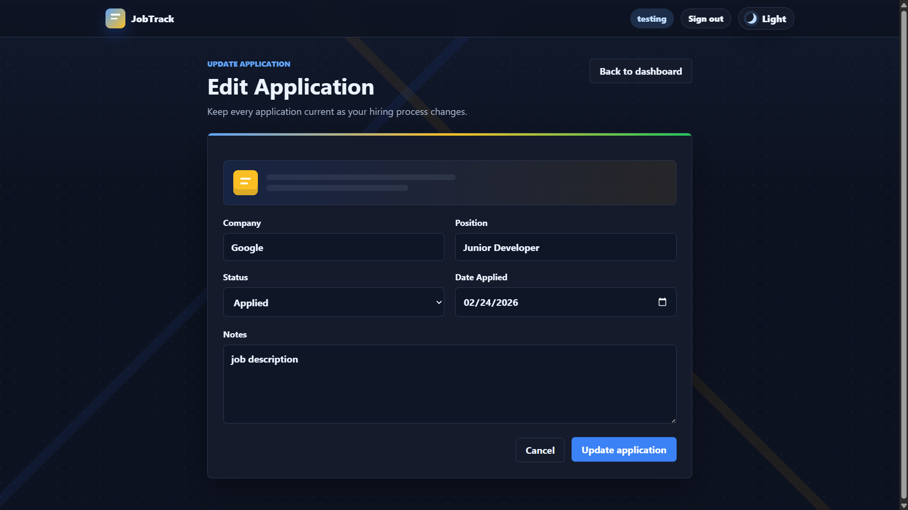

# Job Application Tracker

A Flask web application for tracking job applications with account-based access, email-based sign in, light/dark themes, and a PostgreSQL-ready database setup.

This project was built as a portfolio-ready full-stack web app. Users can create an account, sign in, add job applications, update statuses, edit notes, and manage their own private application list.

## Live Demo

Deployed on Render:

https://job-application-tracker-40oj.onrender.com

## Features

- Email-based account registration and sign in
- Password hashing with Werkzeug
- User-specific job application data
- Add, edit, and delete job applications
- Track company, position, status, date applied, and notes
- Dashboard summary cards for application statuses
- Light and dark theme toggle
- Responsive, portfolio-friendly UI
- PostgreSQL-ready deployment using `DATABASE_URL`
- Local SQLite fallback for development

## Screenshots

### Sign In


### Register


### Email Verification


### Dashboard


### Dashboard Empty State


### Light Theme


### Dark Theme


### Add Application


### Edit Application


## Tech Stack

- Python
- Flask
- Flask-SQLAlchemy
- PostgreSQL / Neon
- SQLite for local development
- HTML
- CSS
- JavaScript
- Render
- Gunicorn

## Project Structure

```text
Job-Application-Tracker/
  app.py
  database.py
  requirements.txt
  render.yaml
  static/
    style.css
    theme.js
  templates/
    add.html
    edit.html
    index.html
    login.html
    register.html
    verify.html
  screenshots/
```

## Local Setup

Clone the repository:

```bash
git clone https://github.com/wadotamagotchi/Job-Application-Tracker.git
cd Job-Application-Tracker
```

Create and activate a virtual environment:

```bash
python -m venv venv
```

On Windows:

```bash
venv\Scripts\activate
```

Install dependencies:

```bash
pip install -r requirements.txt
```

Run the app:

```bash
python app.py
```

Open:

```text
http://127.0.0.1:5000
```

## Environment Variables

For production deployment, set these environment variables in Render:

```text
DATABASE_URL=your_neon_postgres_connection_string
SECRET_KEY=your_random_secret_key
```

Optional email settings for future SMTP email verification:

```text
SMTP_HOST=smtp.example.com
SMTP_PORT=587
SMTP_USERNAME=your_email_username
SMTP_PASSWORD=your_email_password
EMAIL_FROM=your_verified_sender@example.com
```

Do not commit real secrets or database URLs to GitHub.

## Deployment

This app is configured for Render.

Build command:

```bash
pip install -r requirements.txt
```

Start command:

```bash
gunicorn app:app
```

The app uses `DATABASE_URL` when available. If `DATABASE_URL` is not set, it falls back to a local SQLite database.

## Notes

- The deployed database starts empty, so users must register a new account on the live site.
- Free hosting tiers may sleep after inactivity, so the first request can take longer to load.
- Email verification logic is included, but real email delivery requires SMTP environment variables.

## Author

Built by [wadotamagotchi](https://github.com/wadotamagotchi).
